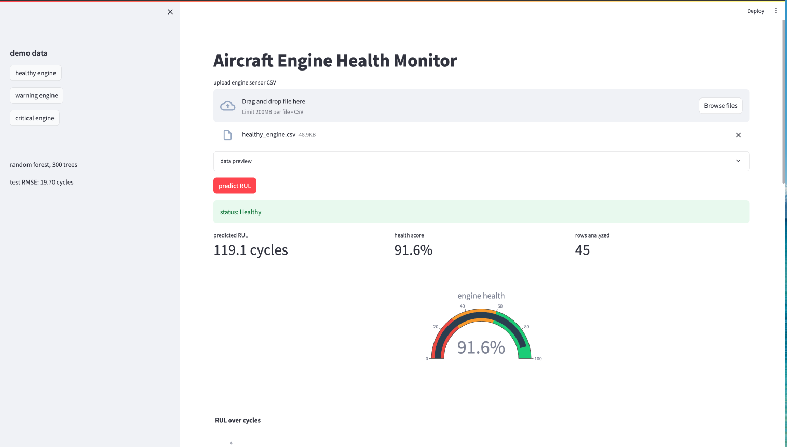
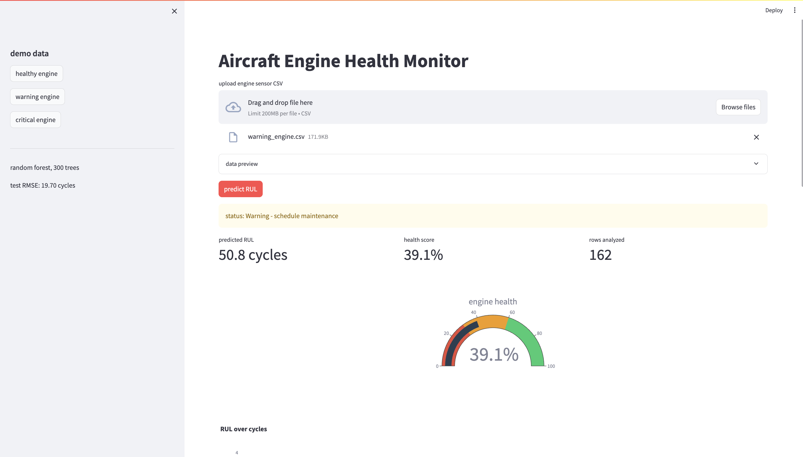
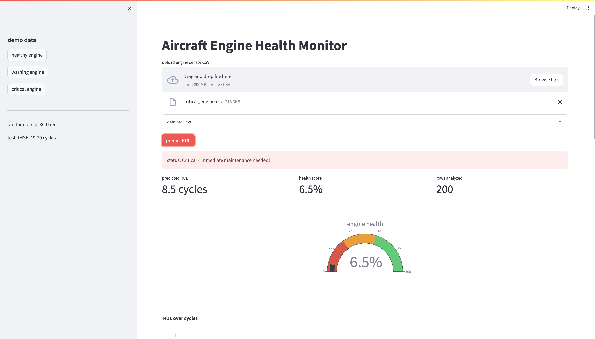

# Engine RUL Predictor

predicting remaining useful life (RUL) of aircraft engines using NASA C-MAPSS sensor data. Built a random forest model with a FastAPI backend and streamlit dashboard.

Started this because i wanted to try an end-to-end ML project with real sensor data.

## results

| model | val RMSE | test RMSE |
|-------|----------|-----------|
| linear regression | 21.43 | 21.93 |
| ridge regression | 21.43 | 21.92 |
| random forest | 18.82 | 19.70 |

random forest with 300 trees, max depth 10, 91 engineered features.

## how to run

**with docker:**
```bash
docker-compose up --build
```
open http://localhost:8501, upload a demo CSV from data/demo/

**locally:**
```bash
pip install -r requirements.txt

cd backend
uvicorn main:app --reload --port 8000

cd frontend
streamlit run app.py
```

## project structure

notebooks go in order:
1. EDA
2. Preprocessing 
3. Feature engineering 
4. Scaling 
5. Modeling

src/ has the reusable functions used across notebooks

## dataset

NASA C-MAPSS FD001 — 100 training engines, 100 test engines, 21 sensors per cycle

## screenshots

**healthy engine (RUL: 119 cycles)**


**warning engine (RUL: ~50 cycles)**


**critical engine (RUL: 8.5 cycles)**
